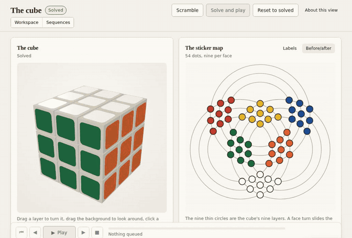
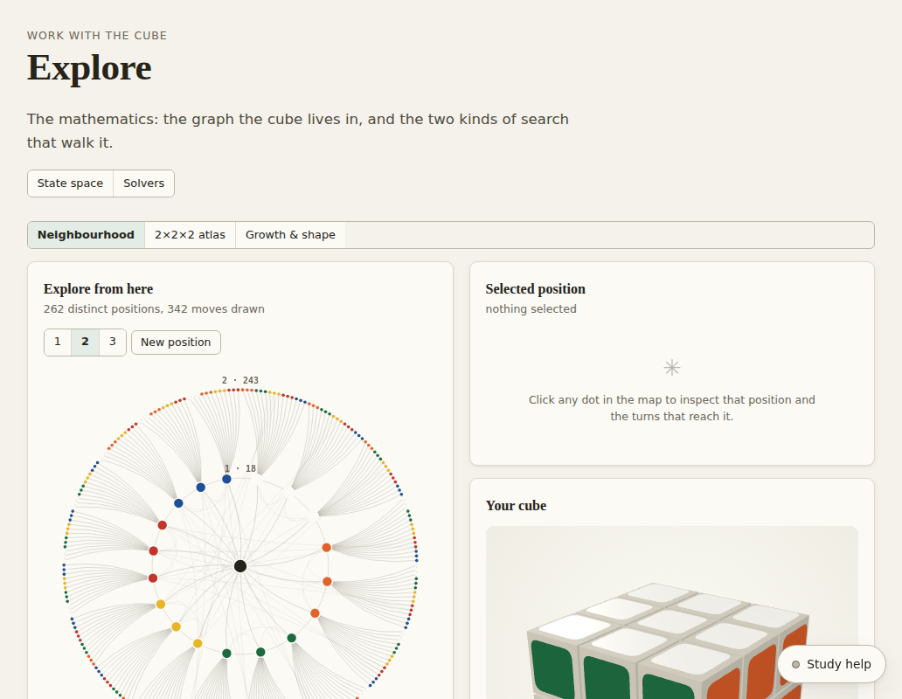
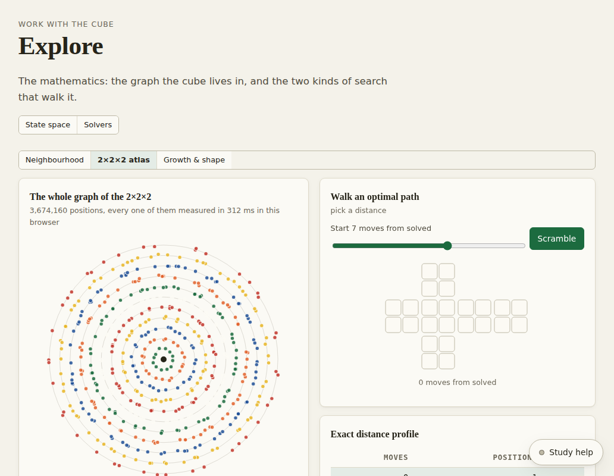
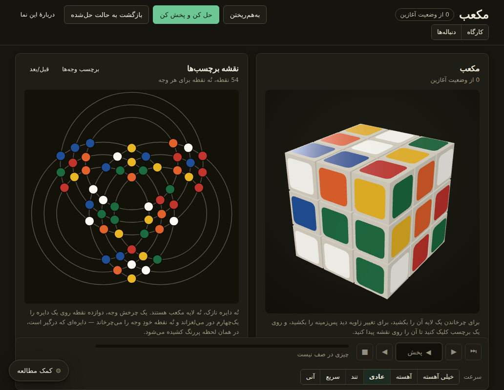

# Cube Atlas

> The Rubik's Cube as a graph with 43 quintillion vertices — solved, animated and explained in your browser, one move at a time.

[](https://github.com/M-Ziraki/rubik_cube/stargazers)
[](LICENSE)
[](tsconfig.json)
[](#quick-start)
[](docs/how-it-works.md#bilingual-support)



<sub>A real recording of the production build: scramble, solve, then play the twenty-move solution back while the sticker map repaints beside the cube. Shown at 1.6× speed.</sub>

## The problem

Cube tutorials teach you algorithms to memorise. Online solvers hand you a
string of twenty letters. Neither shows you what is really going on: that every
arrangement of the cube is a point in a graph of 43,252,003,274,489,856,000
vertices, that solving is finding a path home, and why twenty moves is always
enough — and sometimes necessary.

## The solution

Cube Atlas puts a 3D cube, a live map of all 54 stickers and real solvers side
by side, and plays every solution back one turn at a time. Twelve lessons build
up the mathematics behind it — group theory, graph search, pattern databases,
the 2010 proof of God's number — and every answer says whether it was
*computed*, *proved shortest*, or merely *judged*.

## Quick start

```bash
git clone https://github.com/M-Ziraki/rubik_cube.git && cd rubik_cube
npm install
npm run dev
```

Open <http://localhost:5173>. Node 18+. No account, no API key, no network access needed.

<details>
<summary>Optional: turn on the AI study companion</summary>

Cube Atlas is complete without it. With a [TypeSafe](https://typesafe.ai) key,
an adaptive tutor recommends what to study next, reads your written
explanations, and understands instructions typed in plain words. The key stays
on the server and never reaches the browser:

```bash
cp .env.example .env          # put your key in TYPESAFE_API_KEY
npm run build && npm run serve
```

Then switch it on in **Settings**. What it may and may not decide is set out in
[docs/how-it-works.md](docs/how-it-works.md#the-optional-jev-integration).

</details>

## Features

- ✅ **Drag a real 3D cube**, with a live map of all 54 stickers beside it — one state, two views, never out of step
- ✅ **Solve any position**, typically in 20 moves or fewer in under a second, with Kociemba's two-phase algorithm running in a Web Worker
- ✅ **Provably shortest solutions** where an exhaustive search can reach them, and a proven lower bound where it cannot — nothing is called "optimal" unless it is proved
- ✅ **The whole 2×2×2 graph, computed in your browser** — all 3,674,160 positions, and its God's number (11) derived from scratch
- ✅ **Watch every solution** at six speeds, with play, pause, step, rewind and keyboard control
- ✅ **12 lessons** from move notation to the proof of God's number, each with something to try and a question you can only answer if you understood it
- ✅ **Solve the cube on your desk** — enter its colours, have them checked against the three laws every real cube obeys, and be walked through a solution with a reason for every move
- ✅ **Practice positions at a proven exact distance**, graded against the true optimum
- ✅ **English and Persian**, with a properly mirrored right-to-left layout — while move notation stays left-to-right
- ✅ **Light and dark themes**, with WCAG 2.2 AA text contrast measured in both, at three screen widths, in both languages
- ✅ **Fully offline** — every solver table is built in the browser; no account, no key, no tracking
- ✅ **Optional AI study companion** that recommends and reads, and never touches the cube's mathematics

| The neighbourhood of a position | The whole 2×2×2, all 3.6 million positions | فارسی, dark theme |
|:-:|:-:|:-:|
|  |  |  |

## Use cases

- **You can solve a cube and want to know why it works** — what a move really is, why some positions need twenty moves, and what a solver is doing.
- **You teach or study** group theory, graph search or algorithms, and want a concrete example you can poke at: Cayley graphs, subgroups and cosets, breadth-first search against IDA\*, admissible heuristics.
- **You have a scrambled cube on your desk** and want it solved, with an explanation rather than a string of letters.
- **You build puzzle solvers** and want a tested, readable TypeScript implementation of Kociemba's algorithm and an optimal solver that runs in a browser.

## Comparison

|  | Cube Atlas | Online solver (typical) | Video tutorial (typical) |
|---|:-:|:-:|:-:|
| Solves *your* exact position | ✅ | ✅ | ❌ |
| Says why each move is made | ✅ | rarely | ✅ for its own method |
| Tells you whether a solution is provably shortest | ✅ | varies | — |
| Animated, steppable playback of your solution | ✅ | varies | ❌ |
| Teaches the mathematics — groups, search, God's number | ✅ | ❌ | rarely |
| Works offline, no account | ✅ | ❌ | ❌ |
| Free and open source | ✅ | varies | — |

<sub>The other two columns describe common kinds of resource, not particular products. Plenty of good ones exist, and some do more than their column says.</sub>

## How it works

The short version: the cube engine models 8 corners and 12 edges as a group,
the two-phase solver searches toward the subgroup ⟨U, D, L², R², F², B²⟩ and
then solves inside it, and the optimal solver runs IDA\* guided by pattern
databases, so every length it rules out is ruled out for good. One store drives
both the 3D cube and the sticker map, and a turn is committed before it is
animated, so the picture can never disagree with the state.

The long version — the design system, the sticker map's recovered geometry, the
solver tables and benchmarks, the AI integration's security boundary, and every
test suite — is in **[docs/how-it-works.md](docs/how-it-works.md)**.

## Roadmap

Ideas, not promises — open an issue if one matters to you.

- [ ] Score the AI companion against the live API — so far it has been tested only against a stub server, and its evaluation set in `evals/` has not yet been run against the real model
- [ ] Continuous integration running the unit tests and browser checks on every push
- [ ] Split the JavaScript bundle (1.1 MB today, 324 kB gzipped) so the first page loads faster
- [ ] A faster optimal search — it proves solutions of about a dozen moves comfortably today, but not the hardest positions
- [ ] Camera input for the cube on your desk, instead of entering colours by hand
- [ ] More languages — the translation layer already falls back to English key by key

## Contributing

PRs welcome — bug fixes, lessons, translations, solver work. See
[CONTRIBUTING.md](CONTRIBUTING.md) for setup, the checks to run before a pull
request, and the ground rules. The main one: never label a solution optimal
unless the algorithm proves it.

## License

[MIT](LICENSE) © M-Ziraki

---

<p align="center">⭐ If Cube Atlas helped you understand the cube, give it a star! ⭐</p>
